## Output Screenshots:

## Query

### db.codekata.find()

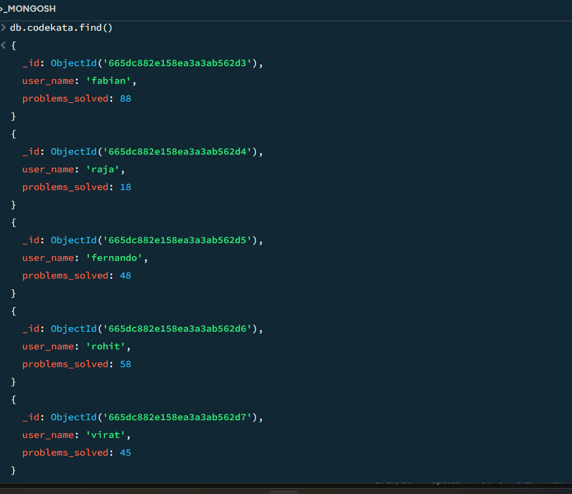

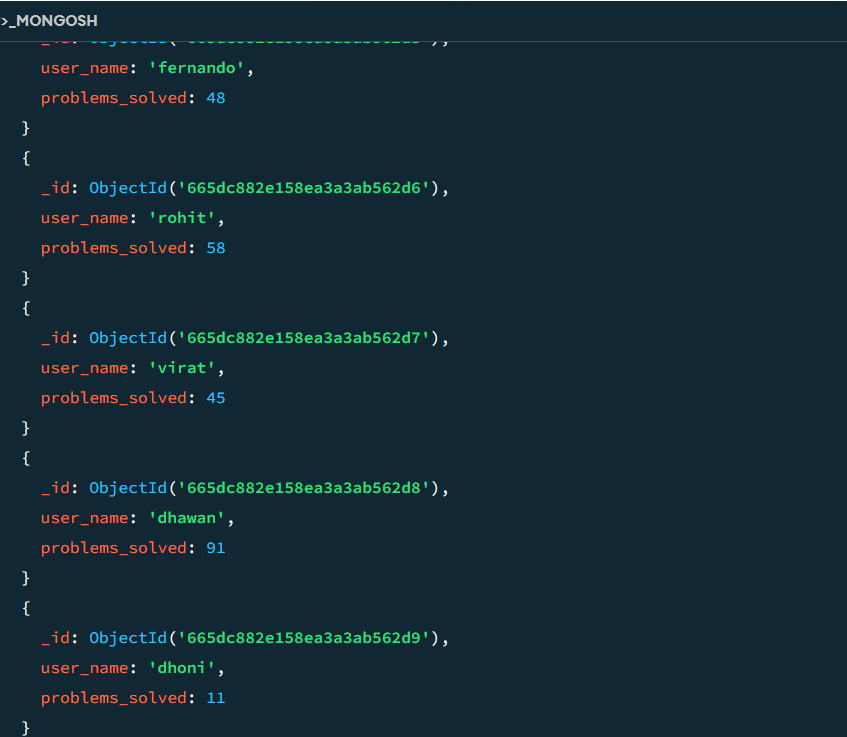

### db.companydrives.find()

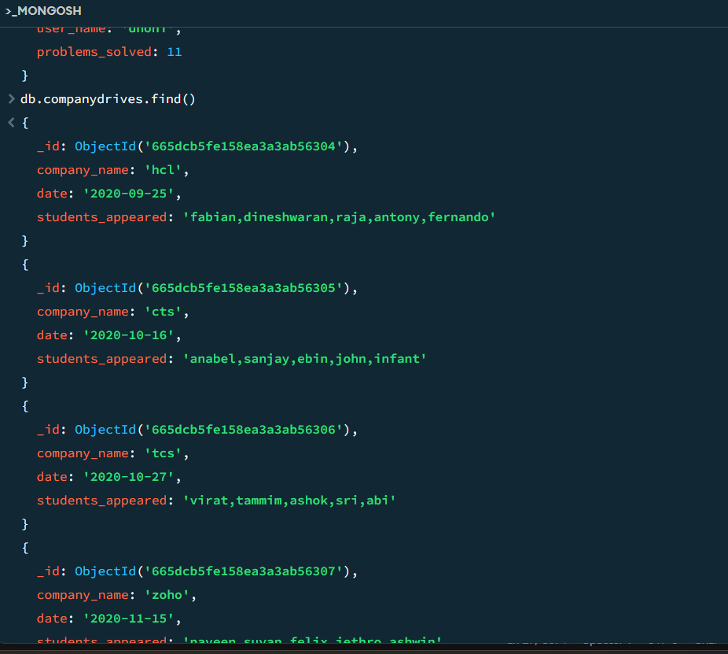

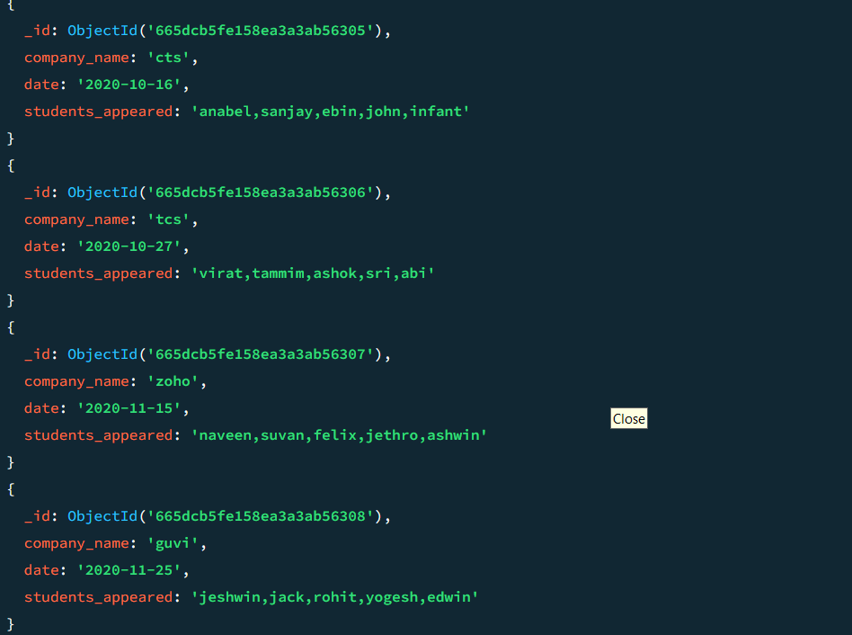

### db.mentors.find()

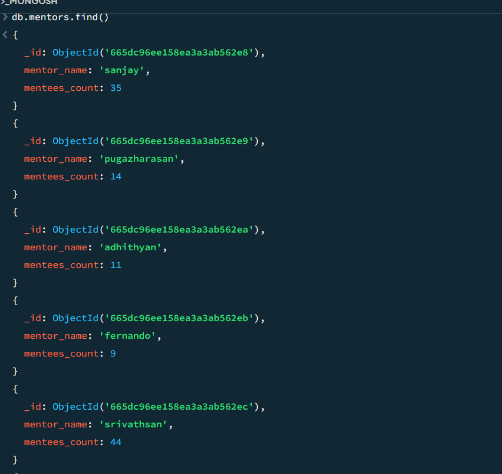

### db.topics.find()

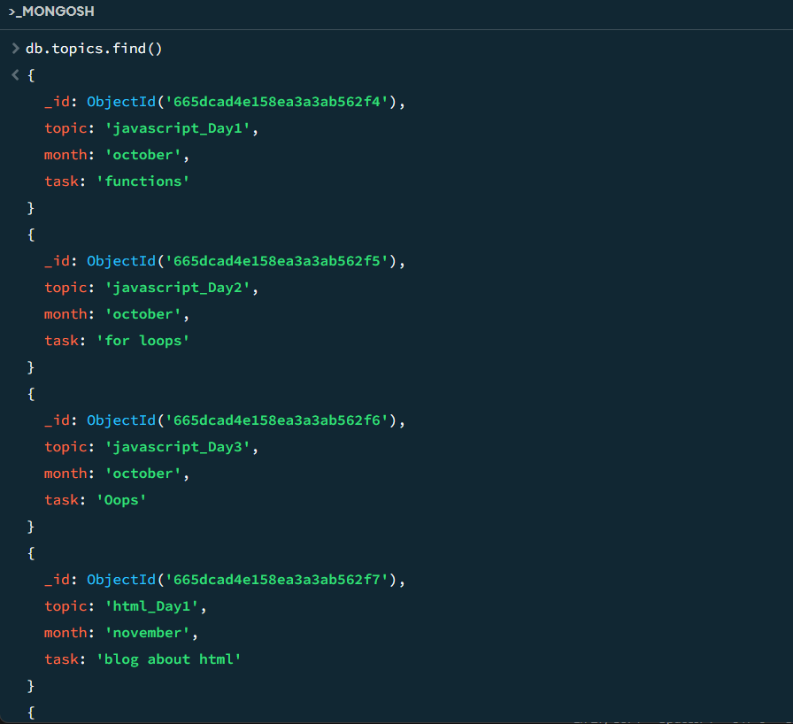

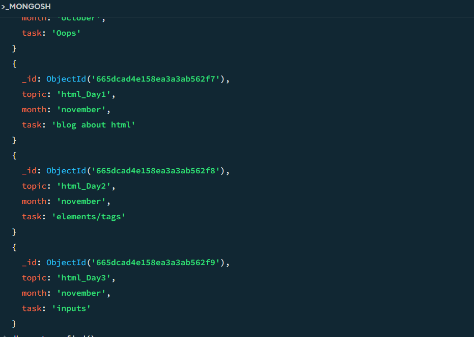

### db.usertask.find()

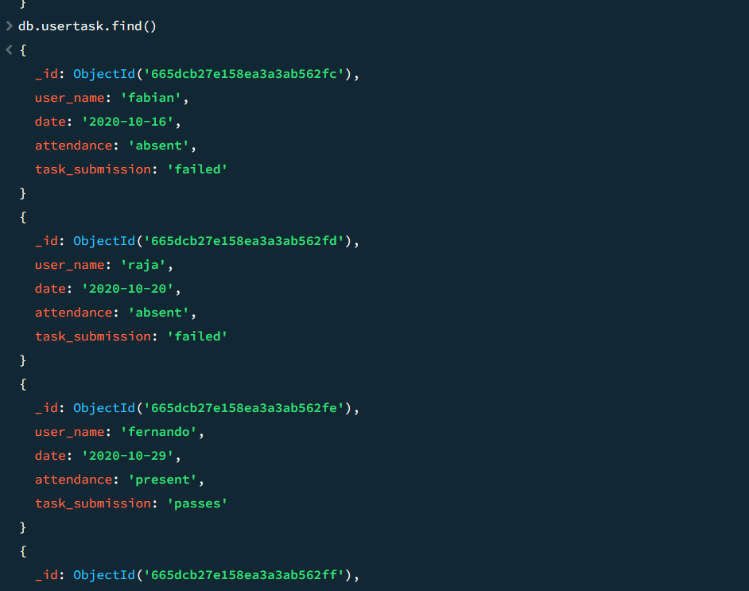

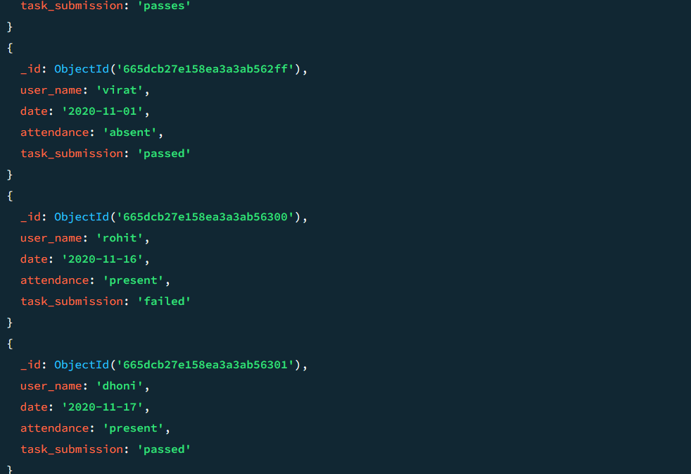

### Question 1 -output:

### Query: db.topics.find({month:"october"})

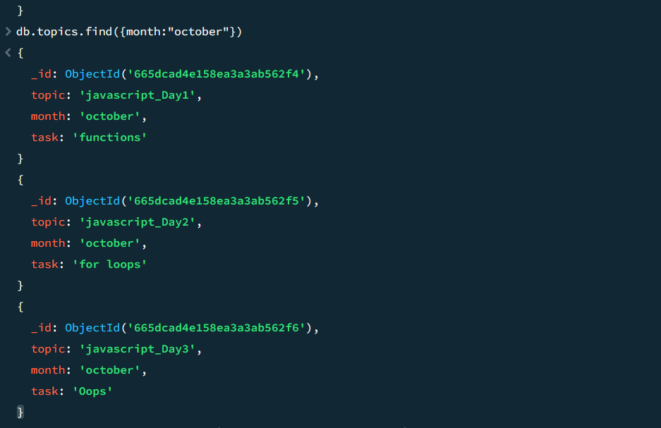

### Question 2 -output:

### Query: db.companydrives.find({date:{$gt:"2020-10-15",$lt:"2020-10-31"}})

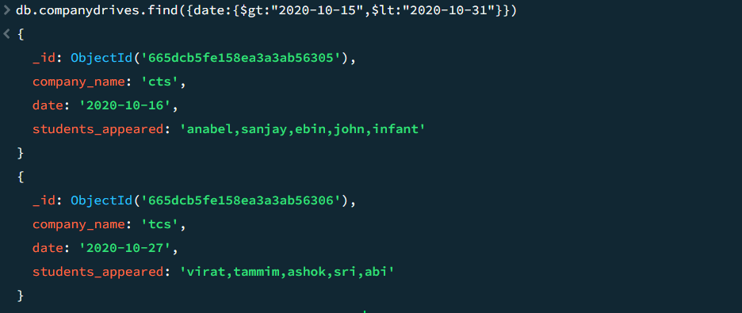

### Question 3 -output:

### Query: 
      db.company_drives.find().forEach(function(value){
    print("Company Name : "+value.company_name);
    print("Students Appeared : "+value.students_appeared);
       })

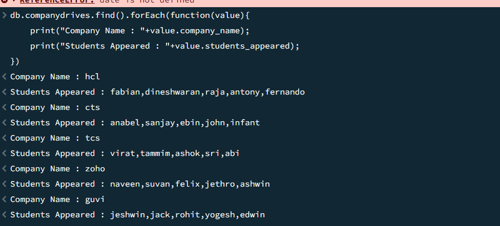

### Question 4 -output:

### Query: 
    db.codekata.find().forEach(function(value){
      
    print("Name : "+value.user_name);
    print("Problems Solved : "+value.problems_solved)
    })

### Question 5 -output:

### Query: db.mentors.find({mentees_count:{$gt:15}})

### Question 6 -output:

### Query: 
      db.usertask.find({date:{$gt:"2020-10-15",$lt:"2020-10-31"}}).forEach(function(value){
    print("Name : "+value.user_name);
    print("Attendance :"+value.attendance);
    print("Task : "+value.task_submission)
     })

